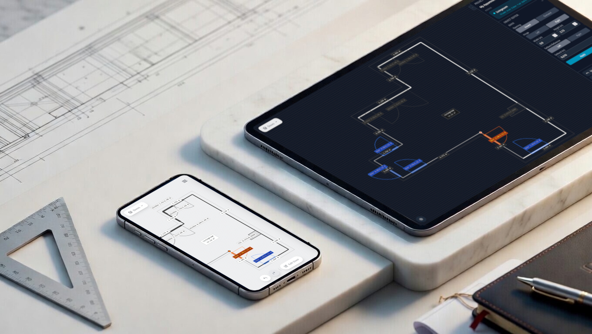

## Status: Alpha

Planimetra is in alpha. It is largely feature-complete for its original purpose -- quickly sketching a single room with accurate wall lengths, openings, and structural elements, and exporting the result as DXF. The core workflow is stable and usable.

What "alpha" means here: rough edges remain, there are no automated tests, and the data model may change between versions. Use it, break it, report issues.

## Platforms

- **Web** - [planimetra.com](https://planimetra.com)
- **Android** - coming soon *(Google Play link placeholder)*

## Features

- 2D canvas for drawing floor plans
- Walls, doors, windows, columns, and passages
- Measurements and geometry helpers
- Wall editing (delete, change length/type/thickness)
- Project save/load and persistence
- Mobile-friendly layout
- Undo/redo
- Layer switching
- DXF export
- PWA offline support

## Possible Future Directions

These are not commitments, just areas worth exploring:

- **Proper floor plan export** - rendered PDF or image output suitable for sharing or printing, beyond the current DXF
- **Furniture layer** - place and arrange furniture objects within a room sketch
- **Project mode / room stitching** - combine multiple room sketches into a single read-only overview of a full floor plan; individual rooms would still be edited separately

## Getting Started

### Prerequisites

- Node.js 18+
- npm or pnpm package manager

### Installation

```bash
npm install
# or
pnpm install
```

### Development

```bash
npm run dev
# or
pnpm dev
```

Opens at `http://localhost:5173`

### Production Build

```bash
npm run build
# or
pnpm build
```

The build output will be in the `dist/` directory.

## Deployment

This project is optimized for deployment on Vercel. Simply connect your GitHub repository to Vercel and it will automatically build and deploy on every push.

## Technologies Used

- **React** - UI framework
- **Vite** - Build tool and dev server
- **TypeScript** - Type-safe development
- **Tailwind CSS** - Utility-first styling
- **Radix UI** - Accessible component library

## License

See [ATTRIBUTIONS.md](ATTRIBUTIONS.md) for license information and attributions.
